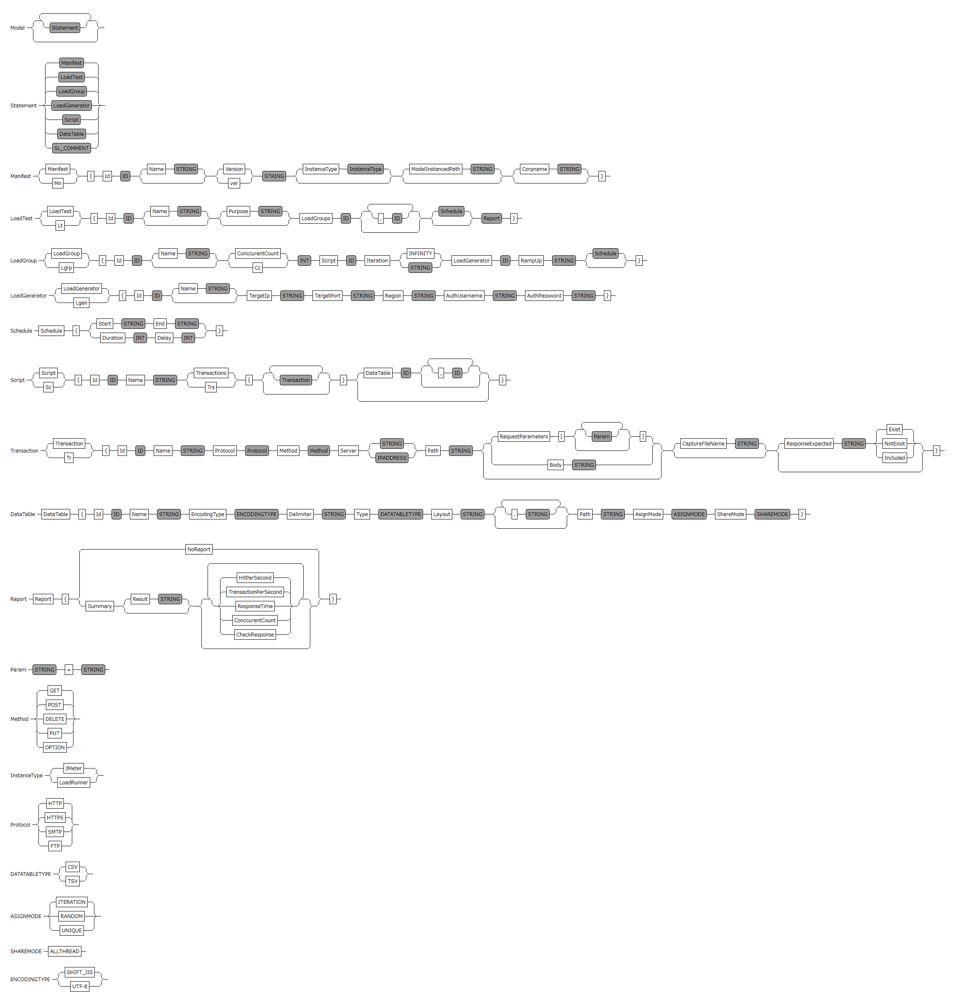
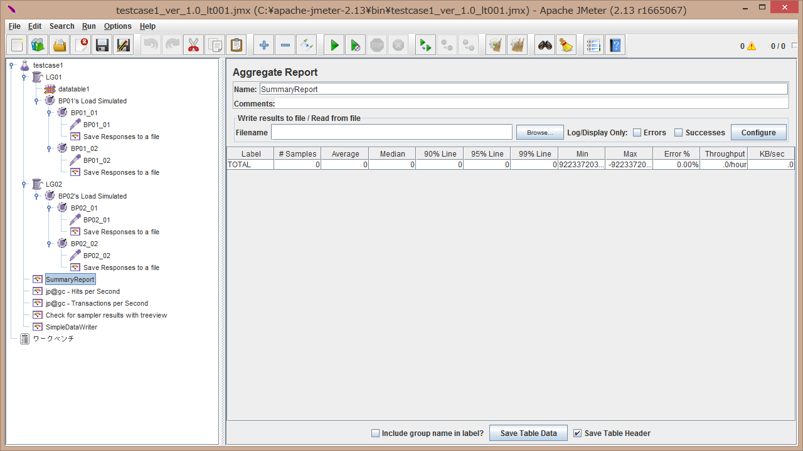

# Ltml

Ltml is a LoadTest Modeling Language(DSL).  
It has some features to define load model(load test cases), script and generate load test instance(e.g. a JMeter Test Plan (jmx file)).  
It could generate not only a JMeter Test Plan (jmx file) but other documentations.    

# Motivations

- System users could understand and write Load Test with model
- Load testers could write Load Test with model
- Load testers and System users could communicate with model
- (It becomes a role of system users and testers are closely.)
- A lot of load testing tools exists. However, A load tester would not want to learn about these tools and languages.
- We(load testers) needs only to learn a unified modeling language

# How to get Ltml

`$ git clone git@github.com:ino9dev/ltml.git`

# **Please Note**

This language is still developing and you could only use experimental language.  
It maybe include not implemented area, bugs, and any changes of specification.  
Please tell me your advice for improvement or pull request.  
Thank you.  

# Compile and Build Ltml

##The Fast Way:  

1. Environment Prerequisite: Java 1.6 or newer; Eclipse 3.8 or 4.2 or newer; Xtext 2.4.  
2. Download this plugin jarfile[(here)](https://github.com/ino9dev/ltml/tree/master/ltml/plugin) and save to eclipse plugin folder(\<\<eclipse_home\>\>\plugins)  
3. Run Eclipse  
4. Create a Java Project  
5. Create a Untitled File *.ltml(ex. test.ltml)
6. Write a Ltml and it auto-generate jmx file.

##The Manual Way:

1. Environment Prerequisite: Java 1.6 or newer; Eclipse 3.8 or 4.2 or newer; Xtext 2.4.
2. Clone https://github.com/ino9dev/ltml (this repository)
3. Import all projects into your Eclipse workspace.
4. Select a project ltml
5. Run as Eclipse Application
6. Create a Java Project
7. Create a Untitled File *.ltml(ex. test.ltml)
8. Write a Ltml and it auto-generate jmx file.

# Ltml Grammar

This grammar is defined with Xtext.  



# Ltml Sample

```
Manifest {
    Id testcase1
    Version "1.0"
    InstanceType JMeter
    ModelInstancedPath "C:\\apache-jmeter-2.13\\bin"
}

//Testcase 1
LoadTest {
    Id lt001
    LoadGroups LG01,LG02
    Report {
       Summary
       Result "C:\\temp\\results\\report_result.csv"
       HitPerSecond
       TransactionPerSecond
       CheckResponse
    }
}

LoadGroup {
    Id LG01
    Name "BP01's Load Simulated"
    Cc 2
    Script BP01
    Iteration "INFINITY"
    LoadGenerator LGen01
    RampUp "20/1min"
    Schedule {
        Duration 500
        Delay 0
    }
}

LoadGroup {
    Id LG02
    Name "BP02's Load Simulated"
    Cc 3
    Script BP02
    Iteration "INFINITY"
    LoadGenerator LGen01
    RampUp "20/1min"
    Schedule {
        Duration 500
        Delay 0
    }
}

LoadGenerator {
    Id LGen01
    TargetIp "192.168.0.5"
    TargetPort "1008"
    Region "Japan"
    AuthUsername "test001"
    AuthPassword "test001"
}

//Business Operation1(e.g search)
Script {
    Id BP01
    Name "BP01_search"
    Trs {
        Tr {
            Id BP01_01
            Name "BP01_01"
            Protocol HTTP
            Method GET
            Server "localhost"
            Path "/"
            CaptureFileName "C:\\temp\\result\\image002"
        }
        Tr {
            Id BP01_02
            Name "BP01_02"
            Protocol HTTP
            Method POST
            Server "localhost"
            Path "/"
            RequestParameters [
                "id"="${datatable1.id}"
                "password"="${datatable.pass}"
            ]
            ResponseHandler {
                Id resp1
                Protocol HTTP
                QueryType REGEX
                QueryString "<input type=\"hidden\" name=\"name\" value=(.*) />"
                Ordnial 1
                SearchLocation BODY
            }
            CaptureFileName "C:\\temp\\result\\image002"
        }
    }
    DataTable datatable1
}

//Business Operation2(e.g purchase)
Script {
    Id BP02
    Name "BP02_purchase"
    Trs {
        Tr {
            Id BP02_01
            Name "BP02_01"
            Protocol HTTP
            Method GET
            Server "localhost"
            Path "/"
            CaptureFileName "C:\\temp\\result\\image002"
        }
        Tr {
            Id BP02_02
            Name "BP02_02"
            Protocol HTTP
            Method POST
            Server "localhost"
            Path "/"
            Body "key=value"
            CaptureFileName "C:\\temp\\result\\image002"
        }
    }
}

//DataTable
// SourceType defines CSV or TSV or XML
// Layout defines columns name
// Path defines source data file path
// AsignMode defines per ITERATION(LOOP), RANDOM, ONCE(if it gets parameter 1 record, that parameter is used every time)
// ShareMode defines ALLTHREAD(parameter is shared by all threads), NOTSHARE
DataTable {
    Id datatable1
    Name "Login Account Data"
    EncodingType UTF8
    Delimiter ","
    Type CSV
    Layout "id","pass"
    Path "C:\\temp\\userdata1.txt"
    AsignMode ITERATION
    ShareMode ALLTHREAD
}
```

# Output

A model instanced file(JMeter jmx file) is generated to following path(is designated with Manifest syntax)

```
C:\apache-jmeter-2.13\bin\testcase1_ver1.0_lt001.jmx
```

A Jmx file image is following



# Task list
- Phase1 Ltml
- [x] implement to handle Report/TransactionPerSecond syntax (20150811 done)
- [x] implement to handle Report/HitPerSecond syntax (20150811 done)
- [x] implement to handle Report/ResponseTimeOverTime syntax (20150811 done)
- [x] implement to handle Report/ConccurentCountOverTime syntax (20150811 done)
- [x] modify Manifest syntax for designation of outputpath(20150813 done)
- [x] modify Manifest syntax for designation of instance type(like JMeter/LoadRunner/OtherTools)(20150813 only JMeter done)
- [x] implement to handle Transaction/Method syntax(-20150905 done only GET/POST/PUT/DELETE)
- [x] implement to handle Transaction/Procotol syntax(-20150905 done only HTTP)
- [x] implement to handle Transaction syntax for CaptureFileName(-20150905 done)
- [x] implement to handle Report/Result syntax(-20150905 done)
- [x] implement to handle Report/CheckResult syntax(-20150905 done)
- [x] implement to handle Transaction/Body syntax(-20150905 done)
- [x] implement to handle Parameter syntax(-20150905 done)
- [x] implement to handle ResponseHandler(it normally means 'Correlation') syntax(20150907 done REGEX only)
- [ ] implement to generate for Documentation and Imaging
- [ ] implement to hanlde validator (e.g unique numbers, correct values)
- [ ] unit tests / tests for acceptance test 
- Phase1 JMeter extension library 
- [ ] implement to controller element "Finish Controller"
- [ ] implement to setting element "DB Parameter"
- [ ] implement to listener element "Result DB Writer"
- [ ] implement to listener element "JMeter Execution Result Collector"
- Phase2
- [ ] implement to handle Variables
- [ ] implement to handle Parameter/Data syntax
- [ ] implement to package syntax
- [ ] implement to handle Load Generator syntax and new method for generating load(e.g using JMeter server or other methods)
- [ ] implement to handle LoadTest/rampup syntax
- [ ] implement to handle Transactions syntax and support not HTTP Transactions
- [ ] implement to execute interpreter modeled load tests   
- [ ] implement to handle Transaction syntax and convert function from Fiddler 4
- [ ] implement to handle interpriter mode
- Phase3
- [ ] implement to handle Load Generator syntax and Load Generator without JMeter remote execution
- [ ] implement to handle difference of locale with load generator
- [ ] implement to export and generate Load Test Document Generator
- [ ] implement to export and generate Load Test Image Generator
- [ ] implement to gather performance data from Load Generator
- [ ] implement to define performance objects(it normally means SLA)
- [ ] implement to analysis performance data and new method for gathering(e.g using JMeter)
- [ ] implement to handle Bigdata/DistributedFilesystems/MapReduce/BigQuery

# Architecture
## current
- Xtext
- Ltml
- JMeter

## future
- Xtext
- Ltml
- Ltml Interpreter
- Other Load Test Software(Like Jmeter but not business(=license needs) use) .. for not depend on JMeter, I think JMeter has some issues for scalability, transaction mix, finish controller and so on(toughness, availability, and maintenancebility). However it should left test cases with Ltml as assets.  
- Software defined middleware/server (Like a chef/vagrant .. for deploy loadtest generator to remote servers 
- Jetty(and so on) on SD middleware/server..  for handling remote execution as restful api and load generator instance

## imagination

Actors :  
System users and Load testers exist  

Behaviors :  

1. System users(or Load testers) define the load test model with Ltml   
2. Load testers modeling detail and execute that instanced model with interpreter.  
3. Interpreter deploy instanced model to other software defined servers and rpc-call Jetty/api on software defined servers.  

# Licenses

License is MIT (MIT license http://opensource.org/licenses/mit-license.php)  
Copyright (c) 2015 ino9dev

# Depend Libraries
Xtext/Xtend
Flotr2 Copyright (c) 2008-2011 Pivotal Labs  

# more information

Learn more at [ino9oni](http://sites.google.com/site/ino9oni/).  
Follow [@inoque](https://twitter.com/inoque) on twitter.  
